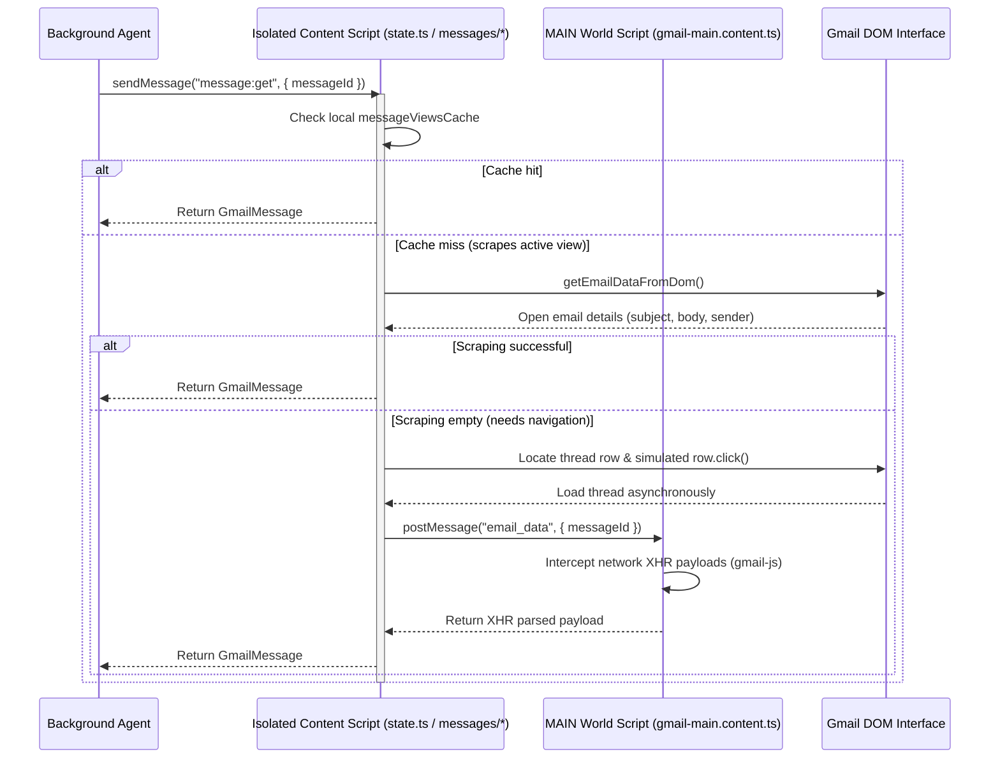

# Gmail Integration Layer

This directory (`packages/wxt/src/gmail`) contains the browser extension's core integration layer with the Gmail interface. It implements the standard agent-facing `GmailClient` interface entirely on top of browser-level DOM/UI interactions and network interception, fully avoiding the need for heavy, interactive Google Cloud OAuth APIs.

---

## Decoupled Architecture

Due to Chrome MV3 security barriers, the execution context is split into three decoupled environments:
1. **Background Service Worker** (`background.ts`): Orchestrates the AI agent and dispatches JSON-RPC requests to the active tab.
2. **Isolated World Content Script** (`content.ts` & `src/gmail/*`): Interacts with InboxSDK and executes safe DOM operations.
3. **MAIN World Content Script** (`gmail-main.content.ts`): Runs natively inside the Gmail page context to intercept XHR/Fetch arrays via `gmail-js`.

---

## Directory Modules

### 1. `state.ts` (Bridge & Cache Initialization)
- **What it does**: Handles the initialization of InboxSDK and manages the shared runtime states, caches, and MAIN-world communication callbacks.
- **How it works**:
  - Automatically loads the InboxSDK framework with a robust 15-second timeout race condition guard.
  - Registers the native `registerMessageViewHandler` to listen for loaded email views.
  - Caches extracted text, sender headers, subjects, and dates into a shared map (`messageViewsCache`) under **both** the `messageId` and `threadId` to support dual-lookup formats.
- **Why**: InboxSDK is the most stable framework for hook registration, but can occasionally experience slow external network load times. Double-key caching guarantees instant resolution whether the agent queries by thread or single-message IDs.

### 2. `messages` + `lib/` (Thread Navigation & Data Extraction)
- **What it does**: Retrieves full raw content, headers, metadata, and message-list refs. Data-bearing paths should prefer MAIN-world gmail-js/Gmail network data.
- **How it works**:
  - **API entrypoint (`messages`)**: Implements agent-facing `messages:list` and `message:get` orchestration.
  - **Gmail toolkit (`lib/*`)**: Shared browser/Gmail primitives used by both `messages` and `labels`, including DOM click helpers, thread row fallbacks, label catalog sources, message formatting, MAIN-world cache access, and Gmail list pagination.
  - **Fallbacks (`lib/thread-fallbacks.ts`)**: Contains DOM row discovery, active-thread scraping, visible-row supplements, and non-SDK thread-opening fallback behavior.
  - **Pagination (`lib/pagination.ts`)**: Contains Gmail range parsing, InboxSDK route-page navigation, and Older/Newer button fallback.
  - **Sources (`lib/thread-list-sources.ts`, `lib/message-sources.ts`, `lib/label-sources.ts`)**: Contains MAIN-world cache/API lookups and polling.
  - **`messages:list` priority**: Use MAIN-world Gmail network interception first for list/search result IDs. The MAIN-world script passively caches Gmail's own thread-list/search responses (`/sync/.../i/bv`, list-shaped `/sync/.../i/fd`, and classic `view=tl`) and never actively replays private sync requests. InboxSDK should only navigate to the requested list/search route and wait for UI readiness.
  - **Pagination (`messages:list`)**: Pagination is handled inside `messages:list`, not exposed as an agent tool. Requests use zero-based `offset` plus bounded `limit`; `offset` itself is not capped. When `offset + limit` exceeds the first collected page, the content script reads Gmail's visible range/page-size indicator when available, uses InboxSDK `Router.goto` with the native list-route `page` parameter to make Gmail load additional pages naturally, then keeps collecting the passively intercepted network responses. Gmail's Older/Newer controls and visible rows remain fallbacks when SDK route pagination or network interception misses.
  - **List-route guard (`messages:list`)**: Detects thread detail pages before fallback scraping. With a query, it opens the matching search route; without a query, it opens Inbox first so row fallback is based on list rows, not the currently open conversation DOM.
  - **Row-scoped list fallback (`getVisibleThreadIdsFromDom`)**: Reads only visible Gmail thread rows (`tr.zA` or row-role equivalents), preventing detail-page `data-thread-id` attributes from being mistaken for list results.
  - **Direct DOM Scraper (`getEmailDataFromDom`)**: Scrapes the open thread header (`h2.hP`), active sender information (`span.gD`), date (`span.g3`), label chips, and full text body (`div.a3s`) instantly.
  - **DOM Clicking fallback**: Scans all `tr.zA` thread rows and inner anchors (`a[href]`) for the target ID and invokes simulated physical `.click()` events.
  - **Network Bridge**: Dispatches asynchronous requests to `gmail-main.content.ts` inside the `MAIN` world to query gmail-js/Gmail network caches.
- **Why**: Modern single-page applications like Gmail ignore basic programmatical address modifications (e.g. changing `window.location.hash`). DOM-clicking and direct DOM-scraping guarantee immediate success for active threads even during initial cold starts where network interception has not populated the cache.

### 3. `labels.ts` (Labels Query & Supported Mutations)
- **What it does**: Lists standard/custom user labels and performs the safe write subset WXT can support without Gmail API authorization from the current Gmail list page: mark unread (`add UNREAD`), mark read (`remove UNREAD`), star/unstar (`add/remove STARRED`), important/not important (`add/remove IMPORTANT`), archive (`remove INBOX`), move to inbox (`add INBOX`), and move visible rows to one custom label.
- **How it works**:
  - **Listing**: InboxSDK provides no listing API. The module first asks the MAIN-world bridge to query Gmail's private `view=omni` JSON endpoint for custom label names, then falls back to expanding the left sidebar "More" button and scraping links (`a[href*='#label/']`) matching custom label patterns. Results are merged with the standard systems list.
  - **List-page updating**: Agent-facing `labels:update` and WXT-internal `labels:batchUpdate` select visible Gmail list rows and click Gmail's native toolbar/menu actions. Single-message agent calls still use this list-page path, so WXT does not open a thread or silently fall back to sequential detail-page updates. If the target row is not visible or the requested Gmail UI action cannot be found, the request fails as `nonRetryable: true`, `userNotified: true`.
  - **Thread-detail helpers**: `lib/thread-detail-label-actions.ts` preserves explicit internal helpers for future/debug flows that intentionally open one thread and operate on its detail page. These helpers are not imported by `labels.ts` and are not used as a fallback for the current list-page label update path.
- **Why**: Since InboxSDK does not provide persistent Gmail label-write APIs and gmail-js exposes label actions as observers rather than a stable direct mutation API, WXT deliberately avoids pretending to support general label updates. Gmail's backend `view=omni` data is preferred for listing label names; sidebar DOM scraping remains the compatibility fallback without requiring Google OAuth credentials.

### 4. `bridge.ts` (RPC Dispatcher)
- **What it does**: Directs JSON-RPC actions dispatched from the background scripts, translating raw requests into corresponding localized functions.
- **How it works**:
  - Receives bridge requests, ensures the current tab's initialization is complete, routes them to `messages`, `labels`, or `state` utilities, and bubbles the formatted responses back.
- **Why**: Keeps the content entrypoint modular and decouples request handling from implementation details.

---

## Core Engineering Principles

1. **Equal Status of Tools**: **InboxSDK** and **gmail-js** are equal, first-class tools. We do not treat gmail-js as a mere backup/fallback.
2. **Prioritization Rules**:
   - **UI Synchronization & Navigation**: Prioritize **InboxSDK** for route changes, waiting for Gmail views to render, and UI actions. Do not use InboxSDK row state as the preferred source for data-bearing results when gmail-js/Gmail network data can provide them.
   - **Data Completeness & Reliability**: Prioritize **gmail-js network interception** over InboxSDK row state and DOM scraping/parsing whenever returning message data, metadata, labels, or list/search result IDs. `messages:list` is included in this rule and should be network-first.
3. **Pragmatism Over Mechanism**: Whether an operation is achieved directly via programmatic APIs or through simulating UI actions (such as DOM manipulation, toolbar clicks, or network interception), the exact mechanism is secondary. What we care about most is whether the chosen approach perfectly, stably, and completely solves the problem.
4. **Decoupled Resilient Flow**: Ensure seamless coordination between the Isolated and MAIN world contexts to resolve queries using whichever method yields the most robust, complete outcome.
